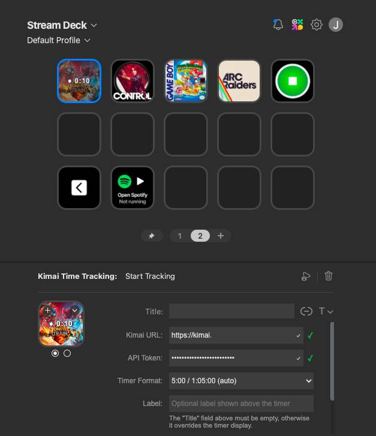
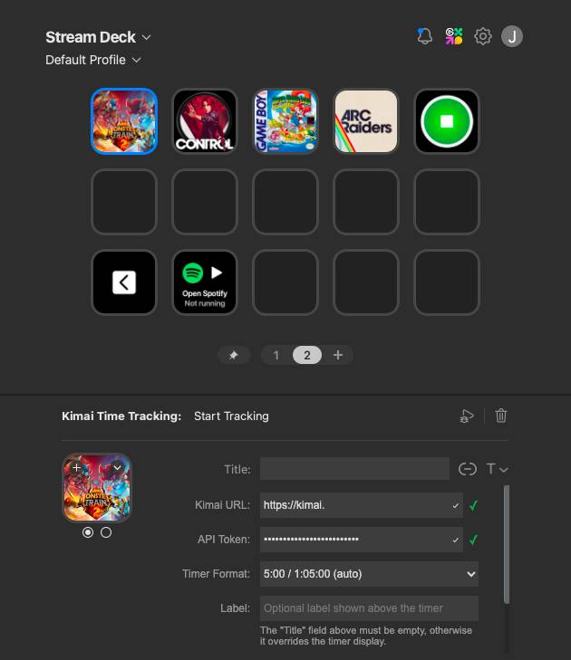
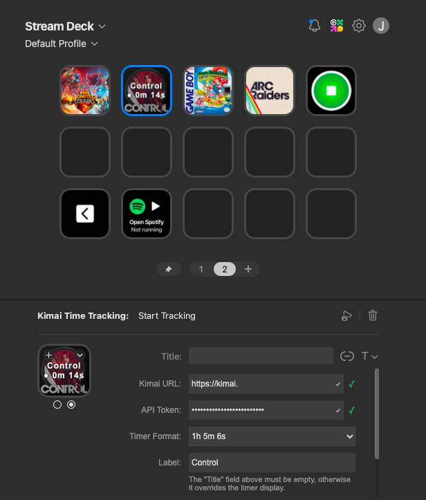

# Kimai Time Tracking for Stream Deck

A [Stream Deck](https://www.elgato.com/stream-deck) plugin that lets you **start** and **stop** [Kimai](https://www.kimai.org/) time tracking entries right from your Stream Deck.



Kimai is an open-source web-based time tracking application that makes it easy to track work across projects and activities, manage timesheets, and generate reports. It's great, you should host it yourself and use it! 

## Features

- **Start Tracking** — Start a timer with a chosen project and activity. Shows elapsed time on the button (e.g. `My Task` + `● 0:05`). Optional label and timer format (auto / HH:MM:SS / verbose).
- **Stop Tracking** — Stop all active Kimai time entries with one press. 
- **Global settings** — Configure Kimai URL and API token once; can be used by all actions.
- **Property inspector** — Per-action project/activity selection for `Start Tracking`.

## Requirements

- **Stream Deck** software 6.9+
- **macOS** 12+ or **Windows** 10+
- A **Kimai** instance with API access (you can generate an API token from your user profile)

## Installation

**From the Marketplace:** Install via the Stream Deck app.

**From source:**

1. Clone this repository, then build the plugin:
   ```bash
   npm install
   npm run build
   ```
2. Copy the `com.joerncodes.kimai-time-tracking.sdPlugin` folder into your Stream Deck plugins directory:
   - **macOS:** `~/Library/Application Support/com.elgato.StreamDeck/Plugins/`
   - **Windows:** `%APPDATA%\Elgato\StreamDeck\Plugins\`
3. Restart the Stream Deck app if it is already running.

Then, just add **Start Tracking** and/or **Stop Tracking** to a key! Open the key’s settings to configure your access and select a project / activity.

## Configuration

### Global settings

Open **any** action and set:

| Setting     | Description |
|------------|-------------|
| **Kimai URL** | Your Kimai base URL, e.g. `https://kimai.example.com` (no trailing slash). |
| **API Token** | Your Kimai API token. In Kimai: **Profile** → **API** to create one. |

These are shared by all Kimai actions in this plugin.



### Start Tracking

| Setting         | Description |
|----------------|-------------|
| **Label**      | Optional text shown above the timer on the button (e.g. task name). Leave the Stream Deck **Title** field empty so the plugin can show the timer. |
| **Timer format** | How elapsed time is displayed: **auto** (e.g. `5:00` / `1:05:00`), **HH:MM:SS**, or **verbose** (e.g. `1h 5m 6s`). |
| **Project**    | Default project for new time entries. |
| **Activity**   | Default activity (depends on selected project). |



### Stop Tracking

Uses only the global Kimai URL and API token. No extra per-action settings.

## Actions overview

| Action            | Description |
|-------------------|-------------|
| **Start Tracking** | Start (or toggle) a time entry with the chosen project/activity. Displays elapsed time on the button. |
| **Stop Tracking**  | Stop all active Kimai time tracking entries. |

> **Tip:** Keep the Stream Deck **Title** field empty for Start Tracking buttons so the plugin can display the running timer. Use the **Label** field in the property inspector for a fixed line of text above the timer.

## Development

### Prerequisites

- **Node.js 20** (required by the Stream Deck plugin runtime)
- npm

### Setup

```bash
npm install
```

### Build

```bash
npm run build
```

Output is written to `com.joerncodes.kimai-time-tracking.sdPlugin/bin/plugin.js`.

### Watch mode

Rebuild on file changes and automatically restart the plugin in Stream Deck:

```bash
npm run watch
```

### Debugging

The plugin runs with the Node.js debugger enabled. Use the **Run and Debug** panel in VS Code and attach via the launch configuration in `.vscode/launch.json`.

### Project structure

```
src/
  plugin.ts              # Entry point — registers actions
  actions/               # One file per Stream Deck action
com.joerncodes.kimai-time-tracking.sdPlugin/
  manifest.json          # Plugin metadata and action declarations
  bin/                   # Compiled output (generated by build)
  imgs/                  # Icons for the plugin and actions
  ui/                    # HTML property inspector UIs (incl. kimai-settings.html)
  logs/                  # Runtime logs (created by Stream Deck)
```

Built with **TypeScript**, **Rollup**, and the official [Elgato Stream Deck SDK](https://developer.elgato.com/documentation/stream-deck/) (v2).

## Support

Issues, questions, or feedback: [code@joernmeyer.name](mailto:code@joernmeyer.name)

## License

MIT
